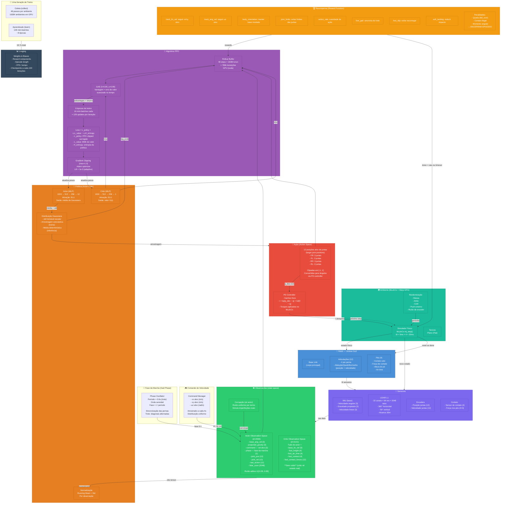

# Diagrama de Blocos — Aprendizado por Reforço do Unitree Go2 com LiDAR



## Legenda dos Conceitos

| Conceito | Descrição |
|---|---|
| **State Space** | Conjunto de observações que o robô percebe: IMU, juntas, LiDAR, comando, fase |
| **Action Space** | 12 posições alvo de juntas (3 por perna × 4 pernas) |
| **Policy (Actor)** | Rede neural que mapeia observação → ação. MLP com 3 camadas ocultas |
| **Critic** | Rede neural que estima o valor V(s) — "quão bom é este estado" |
| **PPO** | Proximal Policy Optimization — algoritmo de RL que limpa o tamanho do update por iteração |
| **GAE** | Generalized Advantage Estimation — calcula a vantagem de cada ação com suavização temporal |
| **Rollout** | Coleta de N passos de interação antes de cada update do policy |
| **Decimation** | 4 passos de simulação MuJoCo para 1 passo de política (50 Hz → 200 Hz física) |
| **Domain Randomization** | Variação aleatória de parâmetros da simulação para transferir para o mundo real (sim-to-real) |
| **Gait Phase** | Oscilador que sincroniza as pernas no padrão de trote (diagonais alternadas) |
| **Reward Shaping** | Função de recompensa composta por múltiplos termos que guiam o comportamento desejado |

## Pipeline de Dados (visão simplificada)

```
Simulação → Sensores → Observações → Actor → Ação → PD Controller → Torques → Simulação
                                        ↓
                     Critic → V(s) → Vantagem (GAE) → PPO Update → novos pesos
```
